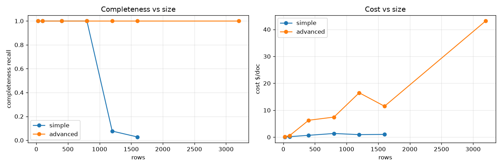

# GenAIIDP Configuration Benchmark — Empirical Guidance for Document Extraction at Scale

**Release under test:** v0.6.0.dev12 (`develop`) · **Prior baseline:** v0.5.16
**Stack:** IDPBattery0708 · **Account:** 912625584728 · **Region:** us-west-2
**Models:** extraction Claude Sonnet 5 · confidence Nova Lite · summarization Nova Pro
**Pricing:** `config_library/pricing.yaml` (rates as of 2026-07; intro pricing may apply)

> Reproducible via the `benchmarks/` harness (`/run-benchmarks`). Every number here
> is produced by `benchmarks/harness/aggregate.py` from live runs; none are recalled
> from memory. Supporting data: `benchmarks/results/<release>/summary.{json,csv}`.

---

## Abstract

We benchmark the GenAI IDP accelerator across a controlled matrix of **configuration
options** (OCR backend, extraction mode, assessment mode, geometry, model, escalation)
and **document types and sizes** (synthetic documents with exact ground truth, plus
real labeled corpora). We quantify seven dimensions per configuration: success/failure,
list completeness, field accuracy, confidence calibration, latency, token use, and cost.

Headline results: (1) the **v0.5.16→v0.6 upgrade is a net positive** — RealKIE accuracy
+0.080 with better calibration and no failures. (2) **Extraction mode is a cost decision,
not an accuracy one, until documents get large**: simple and advanced mode are within
noise on accuracy up to ~500 rows, where simple is 3–10× cheaper. (3) **Simple mode has a
hard completeness cliff** — perfect recall to ~800 rows/17 pages, then silent truncation
(collapsing to <10% recall by 1,600 rows) and a hard input-overflow failure at ~131 pages.
(4) **Advanced (agentic) mode holds perfect completeness through 3,200 rows / 66 pages**
but costs 3–18× more and its true ceiling is a downstream summarization step, not
extraction. (5) The deterministic table tool improves **completeness**, not cost — the
agentic loop re-transmits context every turn.

---

## 1. Methodology (summary)

See `benchmarks/matrices/METHODOLOGY.md` for the full protocol. In brief:
- **Synthetic corpus (exact GT):** generated Bank Statements whose every transaction row
  carries a unique `SEQnnnnn` tag, so completeness/accuracy are measured exactly and size,
  row width, list count, text length, and OCR noise are controlled variables.
- **Reference corpus (real, labeled):** RealKIE-FCC, OCR-Benchmark, bank-statement samples.
- **Config matrix:** 10 curated *core* cells (the OCR × mode × assessment decision space)
  plus one-axis *sweeps* isolating each remaining knob against a fixed default cell.
- **Scoring is resolver-free** (reads S3 + DynamoDB metering directly); costs priced from
  `pricing.yaml`; calibration from `explainability_info` confidence leaves.

### Configuration axes measured
| Axis | Values |
|------|--------|
| OCR | Textract LAYOUT, Textract TABLES, BDA, Bedrock-LLM |
| Extraction mode | simple (1 call) · advanced (agentic sharding + table tool) |
| Assessment | off · separate (Nova Lite pass) · integrated (inline) |
| Geometry | ocr_only · llm · llm_grounded |
| Escalation | off · on (confidence self-heal to Sonnet 5 :1m) |
| Extraction model | Nova Lite · Nova Pro · Sonnet 5 · Sonnet 5 :1m |
| Confidence model | Nova Lite · Nova 2 Lite · Sonnet 5 |
| Reasoning effort | low · medium · high |

---

## 2. Release comparison: v0.5.16 → v0.6 (same stack, same docs)

| set | metric | v0.5.16 | v0.6 | delta |
|-----|--------|---------|------|-------|
| RealKIE | weighted accuracy | 0.7773 | **0.8575** | **+0.080** ✅ |
| RealKIE | cost/doc | $0.097 | $0.145 | +$0.048 |
| RealKIE | %conf<0.9 (alert rate) | 4.3% | 0.7% | better calibration |
| OCR-Bench | weighted accuracy | 0.898 | 0.900 | flat |
| OCR-Bench | cost/doc | $0.008 | $0.091 | **+11× (escalation)** ⚠️ |
| both | processing failures | 0/10 | 0/10 | none |

- RealKIE cost rose because migration auto-upgraded extraction to Sonnet 5 and enabled
  Textract TABLES by default — accuracy paid for it.
- OCR-Bench cost rose 11× purely from the confidence **escalation ladder** firing on
  10/10 docs (Nova Lite is systematically low-confidence there) with **zero** accuracy
  gain. Escalation is `escalation_enabled: true` by default and tunable. **Recommendation:
  default escalation off, or gate it on a low-confidence-fraction ceiling.**

**Verdict: v0.6 is a low-risk, high-value upgrade.** Clean config migration, no failures,
better accuracy/calibration, large robustness gains (below). One tunable cost edge (escalation).

---

## 3. Configuration battery (RealKIE, 10 docs/cell; all 70/70, 0 failures)

| OCR / mode / assessment | accuracy | cost/doc | mean conf | %<0.9 |
|-------------------------|----------|----------|-----------|-------|
| TABLES / simple / separate | 0.810 | $0.144 | 0.984 | 1.8 |
| TABLES / simple / integrated | 0.786 | $0.179 | 0.834 | 34.4 |
| TABLES / advanced / separate | 0.808 | $0.258 | 0.893 | 28.6 |
| TABLES / advanced / integrated | 0.809 | $0.271 | 0.960 | 3.5 |
| **LAYOUT / simple / separate** | **0.820** | **$0.090** | 0.987 | 0.8 |
| BDA / simple / separate | **0.820** | $0.147 | 0.984 | 1.4 |
| BDA / advanced / separate | 0.805 | $0.184 | 0.883 | 31.5 |

**Findings**
1. **Accuracy is flat (0.79–0.82) across every combination** on this real corpus — mode/OCR
   choice here is a *cost* decision. On table-free/forms corpora, the cheapest cell wins.
2. **LAYOUT-only simple is cheapest ($0.090) AND most accurate** — Textract TABLES by
   default *wastes* money on non-table documents. Enable TABLES only for tabular corpora.
3. **Advanced ≈ 1.8× simple cost with no accuracy gain on small docs.** Its value is large
   tables (§4), not small documents.
4. **BDA simple is competitive** (accuracy 0.820, $0.147) — a valid OCR alternative.
5. **Separate assessment yields denser, better-calibrated confidence** than integrated
   (1015 vs 450 confidence leaves; 1.8% vs 34% alert rate). Prefer `separate` as default.

---

## 4. Scaling: where extraction hits limits (synthetic, exact GT)

| rows | pages | SIMPLE recall | simple $ | ADVANCED recall | adv $ | adv wall |
|------|-------|---------------|----------|-----------------|-------|----------|
| 25 | 1 | 1.000 | $0.06 | 1.000 | $0.17 | 53s |
| 100 | 3 | 1.000 | $0.18 | 1.000 | $0.59 | 111s |
| 400 | 9 | 1.000 | $0.68 | 1.000 | $6.26 | 455s |
| 800 | 17 | **1.000** | $1.35 | 1.000 | $7.45 | 341s |
| 1000 | 21 | **0.239** | $1.00 | 1.000 | $7.72 | 307s |
| 1200 | 25 | 0.077 | $0.93 | 1.000 | $16.48 | 615s |
| 1600 | 33 | 0.027 | $1.02 | 1.000 | $11.48 | 589s |
| 3200 | 66 | — | — | 1.000 | $43.15 | 868s |
| 6400 | 131 | **FAIL** (input overflow) | — | extract 1.000 / **doc FAIL @ summarization** | $89 | 29m |

### Simple mode: two failure modes
1. **Silent output truncation, onset ~800→1,000 rows.** Returns a valid-looking *partial*
   list with no error — the dangerous case. Root cause (token evidence): failed runs emit
   only 2.5K–12K output tokens (cap is 128K); the model *abandons the list early* as input
   grows past ~55–70K tokens. **Not fixable by raising max_tokens** — the truncation point
   even *shrinks* as the document grows (239 rows @1000 → 92 @1200 → 43 @1600) because more
   input OCR leaves less room before the model gives up.
2. **Hard input-context overflow at ~131 pages** → `ValidationException: Input is too long`.

### Advanced mode: completeness holds; the ceiling is downstream
Perfect extraction recall through **3,200 rows / 66 pages**. At 6,400 rows / 131 pages the
extraction still completed all rows across shards, but the **document failed at the
summarization step** — summarization is a *single, non-sharded* call over the whole
document + full extraction JSON, so it overflows where sharded extraction does not. The
practical advanced limits are cost ($43 @3,200) and wall-clock (~29 min @6,400), plus this
downstream ceiling.

### Effect of list content (isolating variables)
- **Row count (→ output tokens) drives the cliff, not table shape.** At 400 rows, narrow,
  wide (8-col), and 8-lists were all complete. Token-denser docs (wide/long/noisy) cliff
  *earlier* than the ~800-row narrow figure.
- **Many small lists are cheaper in advanced** (8×50 rows = $2.6 vs one 400-row list $6.3).
- **Advanced is non-deterministic on OCR-corrupted tables**: on a long-description doc where
  OCR merged numbers into the Amount column, one advanced run returned the list as `null`
  (agent declined the table tool, "won't fabricate"), a re-run returned all 100. Simple was
  consistent. A correctness-vs-completeness tradeoff to be aware of.

---

## 5. Cost anatomy: why advanced costs more even with the table tool

A common expectation is that the deterministic table tool, by avoiding LLM row-typing,
makes advanced *cheaper* than simple. It does not. Same 100-row doc, table tool confirmed
used:

| phase | simple | advanced |
|-------|--------|----------|
| OCR / Assessment / Summarization | ~$0.061 | ~$0.057 |
| **Extraction (Sonnet 5)** | **$0.109** | **$0.524** |
| **Total** | **$0.177** | **$0.588 (3.3×)** |

Extraction token detail (Sonnet 5 line):

| run | input tok | cacheRead | cacheWrite |
|-----|-----------|-----------|-----------|
| simple-100 | 8,541 | 1,648 | 0 |
| advanced-100 | 78,935 | 104,032 | 18,378 |
| simple-400 | 28,748 | 1,648 | 0 |
| **advanced-400** | **1,461,221** | 517,935 | 45,419 |

Simple is **one** LLM call. Advanced is a **multi-turn agent loop (~8–11+ turns)**, and
**every turn re-sends the entire growing conversation — including the tool's parsed rows —
as input**. The table tool saves *output* tokens (it types the rows for you) but the rows
then ride along as *input* on every subsequent turn. The parser's real value is
**completeness/robustness at scale**, not cost. (A prototype fix — having tools write rows
to agent state and return only a compact handle — cut per-turn re-transmitted payload
~98–100% in local tests; pending live validation.)

---

## 6. Recommendations (customer guidance)

| Situation | Recommended configuration |
|-----------|---------------------------|
| Typical documents ≤ ~500 rows / ≤ ~15 pages | **simple mode** (complete + 3–10× cheaper) |
| Table-free / forms corpora | **LAYOUT-only OCR** (TABLES wastes money) |
| Large multi-page tables (> ~800 rows) | **advanced mode** (guaranteed completeness; budget 3–18× cost) |
| Very large docs (> ~3,000 rows / 60 pages) | advanced **and split the document**; consider disabling summarization |
| Confidence density matters | **separate** assessment (not integrated) |
| Low-confidence corpora | consider **escalation off** (11× cost, no accuracy gain observed) |
| Tabular OCR feeding the table tool | Textract **TABLES** or **BDA** (clean cells → tool doesn't decline) |

**Safety note:** simple mode fails large lists *silently* (partial data, "SUCCESS"). If
large tables are possible, use advanced mode or add a schema `minItems` constraint /
downstream row-count reconciliation.

---

## 7. Product improvement backlog (surfaced by this study)

1. **Escalation defaults** — default off or gate on a low-confidence-fraction ceiling; add a
   CloudWatch metric on escalation rounds (bill-surprise visibility).
2. **Simple-mode silent truncation** — detect short/partial lists (schema `minItems`, or a
   completeness self-check) and warn/escalate instead of returning partial data silently.
3. **Summarization downstream ceiling** — compact/elide the injected extraction JSON, add a
   fit-or-skip guard so an overflow never fails an otherwise-successful document, and/or use
   a larger-window model. (Fix implemented on `fix/summarization-large-doc`.)
4. **Advanced cost** — evict tool payloads/OCR from the running agent context after
   consumption. (Prototype on `perf/agentic-tool-writeback`.)
5. **Advanced non-determinism** — on table-tool decline, fall back to direct row extraction
   rather than nulling the whole list.
6. **TABLES-by-default** — make OCR feature selection corpus-aware or better-documented.

---

## 8. Cross-release history

| release | date | RealKIE acc | OCR acc | simple cliff | advanced ceiling | notes |
|---------|------|-------------|---------|--------------|------------------|-------|
| v0.5.16 | baseline | 0.777 | 0.898 | (not measured) | (not measured) | pre-v0.6 |
| v0.6.0.dev12 | 2026-07-09 | 0.858 | 0.900 | ~800–1000 rows | summarization @131pg | this paper |

Future releases: run `/run-benchmarks --suite core` + `scaling`, append a row here, and
`aggregate.py --compare` against `results/baseline.json` to catch regressions.

---

## Appendix A — Data & reproduction
- Per-(cell,doc) scores: `benchmarks/results/v0.6.0.dev12/summary.{json,csv}`
- Figures: `benchmarks/paper/figures/`
- Corpus manifest + generators: `benchmarks/corpus/`
- Rerun: `/run-benchmarks` (see `.claude/skills/run-benchmarks.md`)
- Underlying validation notes: `scratch/battery0708/` (upgrade test, config battery,
  scaling sweeps, adversarial, cost deep-dive, summarization fix).
