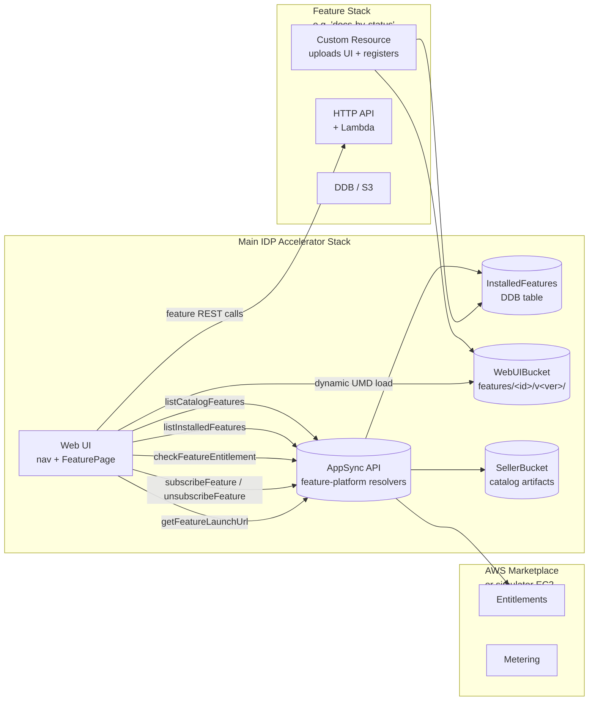
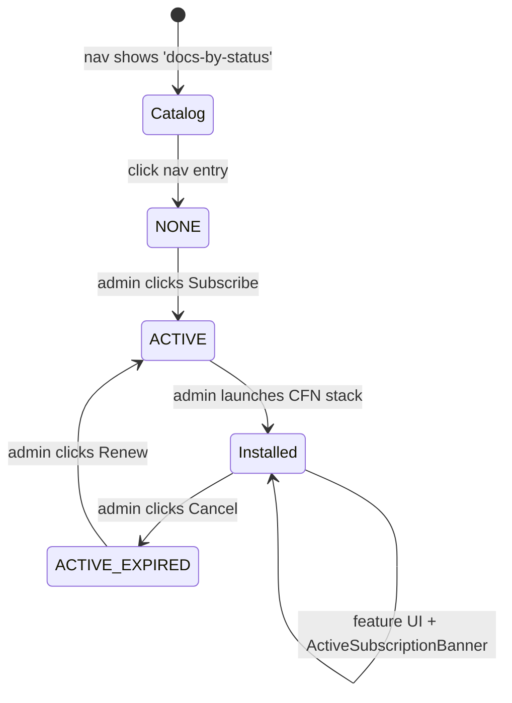

# Feature Platform

> **Status: prototype (opt-in).** The Feature Platform is off by default
> (`EnableFeaturePlatform=false`). Deployments are fully backward compatible
> with earlier releases when the flag is left at its default.

The Feature Platform turns the IDP Accelerator main stack into a **host** for
*installable subscription features* delivered through AWS Marketplace — or,
for local development, through the bundled
[marketplace-simulator](../subscription-features/marketplace-simulator/README.md).

A "feature" is an independent CloudFormation stack that an admin launches
into the **same AWS account** as the main IDP stack. Once the feature stack
creates, a custom resource uploads the feature's UI bundle into the main
stack's `WebUIBucket` and registers itself in the `InstalledFeatures` DDB
table. From that moment on the feature appears as a new nav item inside the
existing IDP web UI, with its own page backed by a UMD-loaded React bundle.

## Architecture



### Moving pieces

| Component | Lives in | Purpose |
|-----------|----------|---------|
| `FeaturePlatformStack` | nested stack from `subscription-features/feature-platform/main-stack-extensions/template.yaml` | Owns the `InstalledFeatures` table, 7 feature-platform Lambdas, and AppSync data sources / resolvers |
| `SimulatorStack` | nested stack from `subscription-features/marketplace-simulator/template.yaml` | Optional EC2 that implements the Marketplace API locally; auto-created when `FeaturePlatformSimulatorEndpoint` is left blank |
| `SellerBucket` | main `template.yaml`, condition-gated on `EnableFeaturePlatform` | Holds the catalog of published features (CFN template + UI bundle + `feature.yaml` manifest per feature) |
| Feature stack | standalone CFN template published by the author via `idp-feature-cli publish` | Creates the feature's own resources + registers into the main stack |

### GraphQL surface

| Operation | Auth | Purpose |
|-----------|------|---------|
| `listCatalogFeatures: [CatalogFeature!]!` | Cognito user | Features published to the seller bucket (includes not-yet-installed) |
| `listInstalledFeatures: [InstalledFeature!]!` | Cognito user | Features whose stack has been launched & registered |
| `checkFeatureEntitlement(featureId): FeatureEntitlement!` | Cognito user | `NONE` / `ACTIVE` / `EXPIRED`, with `expiresAt` + `source` |
| `getFeatureLaunchUrl(featureId): FeatureLaunchUrl!` | Cognito user (Admin for launching) | Pre-signed CFN quick-create URL |
| `subscribeFeature(featureId): FeatureEntitlement!` | Admin group | Calls simulator admin API (or would redirect to Marketplace in production) |
| `unsubscribeFeature(featureId): FeatureEntitlement!` | Admin group | Calls simulator admin API |

Each GraphQL operation is backed by a Lambda under
`subscription-features/feature-platform/main-stack-extensions/lambdas/`.

## UX flow

Once the stack is up with `EnableFeaturePlatform=true` and the sample
`docs-by-status` feature auto-published to the seller bucket (which happens
at deploy time — see Task 3 below), the flow the user experiences is:



Concretely:

1. **Stack deploy** — `idp-cli deploy --params EnableFeaturePlatform=true`
   brings up the main stack, the simulator EC2, and the seller bucket
   together. A custom resource copies the `docs-by-status` catalog artifacts
   into the seller bucket as part of stack create.
2. **Nav entry appears** — the UI calls `listCatalogFeatures`; the sample
   feature shows in the nav with a grey "Subscribe" badge even though it is
   not yet installed.
3. **FeaturePage (NONE)** — clicking the nav entry opens the FeaturePage in
   the `NONE` state. Admins see a primary **Subscribe** button alongside the
   optional Marketplace link; non-admins see only the Marketplace link.
4. **Subscribe** — `subscribeFeature` calls the simulator's admin API
   (`POST /admin/entitlements`), which grants the entitlement. The
   FeaturePage transitions to `ACTIVE` without a page reload; entitlement +
   installed caches are refreshed in parallel.
5. **InstallPrompt** — the `ACTIVE, not-installed` state renders
   `InstallPrompt` with a CFN Console quick-create "Launch Stack" URL built
   from the catalog artifact's S3 template URL.
6. **Launch Stack** — the admin clicks the URL, confirms parameters, and
   the feature's CFN stack creates. A `RegisterFeature` custom resource
   inside the feature stack writes to `InstalledFeatures` and uploads the
   feature's UMD bundle into `WebUIBucket/features/<id>/v<ver>/`.
7. **Working feature UI** — the FeaturePage now renders the feature's own
   React bundle plus a green **ActiveSubscriptionBanner** (`Subscription
   active · expires <date> · Source: <simulator|marketplace>`). Admins get
   a **Cancel Subscription** button in the banner's action slot.
8. **Cancel / renew** — clicking Cancel calls `unsubscribeFeature`, which
   calls the simulator's expire endpoint. The page transitions to the
   `EXPIRED` state with a dimmed UI and a **Renew** CTA (subscribe again).

## Deployment

```bash
idp-cli deploy --params EnableFeaturePlatform=true
```

That single command brings up:

- the main IDP stack,
- a Marketplace simulator EC2 (t3.small, ~$8/month) — only when
  `FeaturePlatformSimulatorEndpoint` is left blank; supply your own
  Marketplace-compatible endpoint to skip the EC2,
- the `InstalledFeatures` DDB table + feature-platform Lambdas,
- the `SellerBucket` pre-loaded with the `docs-by-status` sample feature.

To turn the feature platform off, leave the parameter at its default
(`EnableFeaturePlatform=false`) — no new resources are created, and the
nav shows no feature entries.

### Tear-down

```bash
idp-cli delete
```

All feature-platform resources carry `DeletionPolicy: Delete`, including
the simulator's EC2, security group, EIP, DDB table, and S3 seller
bucket, so the stack tears down cleanly. Any feature stacks the admin
launched separately must be deleted by the admin (they live in the same
account but are outside the main stack's dependency graph).

## Extension points

- **Add a new feature** — scaffold a new feature project from the bundled
  template with one CLI command:

  ```bash
  pip install -e lib/idp_feature_sdk
  idp-feature-cli init ./my-feature \
      --feature-id my-feature \
      --display-name "My Feature"
  ```

  This copies `subscription-features/feature-platform/feature-template/` into
  `./my-feature` and substitutes the placeholder featureId / displayName /
  version literals throughout (`feature.yaml`, `template.yaml`,
  `entry.tsx`, `App.tsx`, `package.json`, `handler.py`, `README.md`),
  giving you a working feature you can iterate on. Then follow
  [`subscription-features/feature-platform/docs/CREATING-A-FEATURE.md`](../subscription-features/feature-platform/docs/CREATING-A-FEATURE.md)
  for the host-contract details and
  [`PUBLISHING-A-FEATURE.md`](../subscription-features/feature-platform/docs/PUBLISHING-A-FEATURE.md)
  for pushing artifacts into the seller bucket. Once published, the new
  feature appears in the IDP nav automatically (the UI fetches the
  catalog from the seller bucket via `listCatalogFeatures` — no main-stack
  rebuild needed).
- **Swap the simulator for real Marketplace** — set
  `FeaturePlatformSimulatorEndpoint` to a Marketplace-compatible URL. The
  `subscribeFeature` / `unsubscribeFeature` mutations raise an error when
  the admin endpoint is blank, so the UI falls back to the optional
  Marketplace link on the `NONE`/`EXPIRED` states.
- **Custom catalogs** — point `SellerBucketName` at an existing seller
  bucket (e.g. shared across environments) instead of the auto-created one.

## Cost

With the feature platform on and the simulator auto-deployed:

- Extra cost: ~$8/month (t3.small EC2 + EIP + small EBS)
- Extra resources: ~20 (EC2 + SG + EBS + EIP + IAM role + S3 seller bucket
  + DDB `InstalledFeatures` table + 7 Lambda functions + their log groups
  + their IAM roles)
- Extra create time: ~3–5 minutes (EC2 boot + Caddy HTTPS cert via Let's
  Encrypt)

With the default (`EnableFeaturePlatform=false`), none of those resources
are created.

## Related docs

- [`subscription-features/feature-platform/docs/README.md`](../subscription-features/feature-platform/docs/README.md)
  — **start here** for feature authors: ordered reading list, mental
  model, FAQ
- [`subscription-features/feature-platform/README.md`](../subscription-features/feature-platform/README.md)
  — implementation directory layout + build phases
- [`subscription-features/feature-platform/docs/CREATING-A-FEATURE.md`](../subscription-features/feature-platform/docs/CREATING-A-FEATURE.md)
  — how a feature author scaffolds a new feature
- [`subscription-features/feature-platform/docs/HOST-CONTRACT.md`](../subscription-features/feature-platform/docs/HOST-CONTRACT.md)
  — `FeatureContext` API reference + `window.*` externals contract +
  versioning policy
- [`subscription-features/feature-platform/docs/PUBLISHING-A-FEATURE.md`](../subscription-features/feature-platform/docs/PUBLISHING-A-FEATURE.md)
  — how to publish a feature to the seller bucket
- [`subscription-features/feature-platform/docs/SAMPLE-FEATURE-WALKTHROUGH.md`](../subscription-features/feature-platform/docs/SAMPLE-FEATURE-WALKTHROUGH.md)
  — file-by-file annotated tour of the bundled `docs-by-status` sample
- [`subscription-features/marketplace-simulator/README.md`](../subscription-features/marketplace-simulator/README.md)
  — simulator internals (admin + data-plane endpoints, Caddy config)
