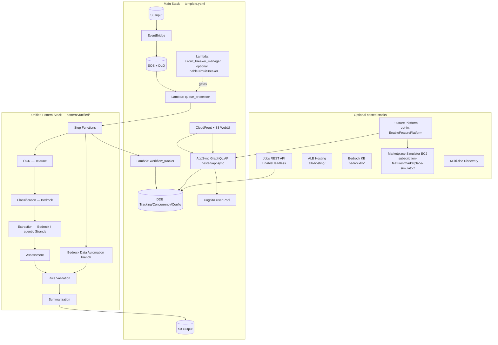

# System Patterns — GenAIIDP

## High-level architecture



## Repo layout (keep this mental map)

```
template.yaml                         ← main CFN template (entry point)
patterns/unified/template.yaml        ← only supported processing pattern
nested/                               ← nested stacks extracted from main
    appsync/                          ← AppSync + resolvers (generated)
    alb-hosting/                      ← ALB-fronted web UI variant
    bedrockkb/                        ← Bedrock Knowledge Base integration
    multi-doc-discovery/
src/lambda/                           ← main-stack Lambda handlers (Python)
src/ui/                               ← React / Vite / Cloudscape web UI
lib/
    idp_common_pkg/                   ← shared Python lib — core of backend
    idp_cli_pkg/                      ← batch CLI (idp-cli)
    idp_sdk/                          ← Python SDK for customer scripts
    idp_mcp_connector_pkg/            ← MCP connector for Q/Quick Suite
    idp_feature_sdk/                  ← Feature Platform SDK (idp-feature-cli)
subscription-features/
    feature-platform/                 ← main-stack extensions + sample feature + template
    marketplace-simulator/            ← EC2-backed simulator for marketplace API
scripts/                              ← build / deploy / ops tooling
config_library/                       ← canned unified-pattern configs (yaml)
docs/                                 ← canonical markdown docs (mirrored to docs-site/)
docs-site/                            ← Astro/Starlight docs site build
threat-modeling/                      ← threat model + mitigation reports
```

## Key technical patterns in use

### 1. Nested CFN with opt-in parameters

- Main `template.yaml` exposes parameters like `EnableHeadless`,
  `EnableFeaturePlatform`, `EnableCircuitBreaker`, `DeployInVPC`,
  `DeployBastionHost` — all default *off*.
- Each maps to a `Conditions:` entry and controls whether a nested stack
  or resource block is created.
- `Rules:` section fails fast on invalid combos (e.g. `EnableHeadless`
  requires `DeployInVPC`). When a `Rules:` rule is removed, a comment is
  left in place explaining why (see current diff in `template.yaml`:
  the `FeaturePlatformSimulatorRequiresVPC` rule was just removed after
  the simulator started auto-creating its own VPC).

### 2. Configuration is data, not code

- `Configuration` DDB table stores `Default` (built-in presets shipped
  via `config_library/unified/*/config.yaml`) and `Custom` (user
  overrides). All processing Lambdas read from DDB at runtime via
  `idp_common.config`.
- `idp-cli config-upload` + `config-validate` are the supported write
  paths. Managed-preset uploads are rejected (`managed: true` guard).

### 3. Python shared library via relative-path install

- Lambdas put `../../lib/idp_common_pkg[extraction]` in
  `requirements.txt`. SAM builds the layer fresh each time.
- Extras split: `[core]`, `[ocr]`, `[classification]`, `[extraction]`,
  `[evaluation]`, `[all]` — keeps per-Lambda package size small.

### 4. GovCloud-safe ARN/URL partitioning

- Never hardcode `arn:aws:` or `amazonaws.com`. Always use
  `arn:${AWS::Partition}:` and `${AWS::URLSuffix}`.
- Enforced by `make check-arn-partitions` (Makefile target).
- Headless-only template `idp-headless.yaml` skips commercial-only
  resources (AppSync / CloudFront) so it lints under `us-gov-*`.

### 5. Circuit breaker state machine

- `ConcurrencyTable` holds state (`CLOSED` / `OPEN` / `HALF_OPEN`).
- All writes are conditional DDB updates → no clobbering from
  concurrent alarm + workflow callers.
- CloudWatch Alarms (via SNS) open the breaker; EventBridge-scheduled
  health check promotes OPEN→HALF_OPEN; `workflow_tracker` closes on
  first successful probe.
- `queue_processor` gates new work before incrementing concurrency.

### 6. Defense-in-depth authorization

- Cognito pool + groups (`Admin`, default user).
- UI hides admin-only buttons, AppSync schema uses `@aws_auth`
  directives, resolver Lambdas re-check the caller's groups.
- Headless Jobs API has its *own* Cognito pool + Resource Server with
  `idp-api/jobs.read` and `idp-api/jobs.write` scopes (separate from UI
  pool).

### 7. Feature Platform dynamic UI loading

- Features publish a UMD React bundle to `WebUIBucket/features/<id>/v<ver>/`.
- Web UI's `FeaturePage` dynamically `<script>`-loads that UMD at runtime
  and passes a context object (AppSync client, Cognito creds, etc.).
- Subscribe/entitlement state is a 7-state machine surfaced through
  `ActiveSubscriptionBanner` + nav badges.

### 8. Testing strategy

- `lib/idp_common_pkg/tests/` + `idp_cli/tests/` — pytest with `unit` vs
  `integration` markers. Integration tests use `moto` for AWS mocking.
- UI: vitest, ~80 UI tests under `src/ui/`.
- Security: SRT (open-source successor to DSR) runs in GitLab CI on MRs
  targeting `develop`. `make srt` locally.
- CFN: `cfn-lint` runs as part of `publish.py`. Headless mode lints a
  different template than commercial.

### 9. Build pipeline

- `publish.py <bucket-basename> <prefix> <region> [--verbose]` is the
  canonical build; uses SAM under the hood.
- UI checksum (`src/ui/.checksum` + `.checksum`) skips UI rebuilds when
  unchanged.
- Nested template regeneration: `scripts/generate_nested_template.py`
  splits AppSync out of the main template to stay under CFN resource
  limits.

## Critical implementation paths

- **"Add a new CFN parameter"**: add to `template.yaml` Parameters +
  Interface metadata (`ParameterGroups`, `ParameterLabels`) + relevant
  `Conditions` + any needed `Rules` assertions + doc update + CHANGELOG.
- **"Add a new Lambda"**: new directory under `src/lambda/<name>/` with
  `index.py` + `requirements.txt` pointing at `idp_common_pkg[<extra>]`
  + CFN resource in `template.yaml` or nested template + unit test under
  `lib/idp_common_pkg/tests/` or sibling `tests/` folder.
- **"Add a GraphQL operation"**: schema update in AppSync nested
  template + VTL or Lambda resolver + resolver auth directive + UI hook
  using `@aws-amplify/api` GraphQL client.
- **"Add a new config key"**: bump `config_library/TEMPLATE_README.md` +
  update the affected preset + add validation in
  `idp_common/config/validation.py` (or wherever `config-validate`
  lives) + CHANGELOG entry.
