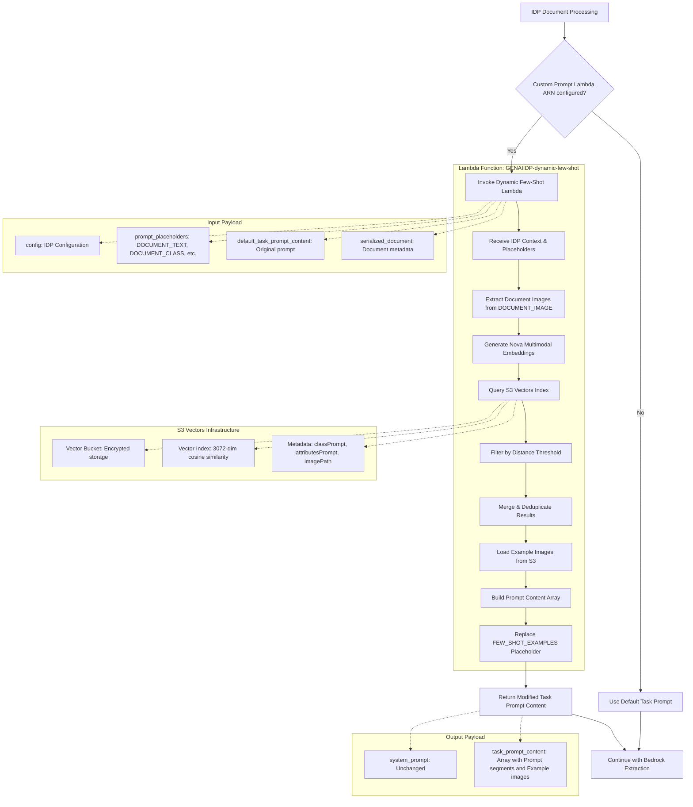

# Dynamic Few-Shot Prompting Lambda - Complete Guide

This directory contains the **complete implementation** of the dynamic few-shot prompting Lambda function for GenAI IDP Accelerator. This Lambda function integrates with Pattern 2 extraction as a custom prompt generator, dynamically retrieving similar examples using S3 Vectors similarity search to improve extraction accuracy.

## 🎯 Overview

The dynamic few-shot prompting Lambda function allows you to:

- **Dynamically retrieve similar examples** based on document content using vector similarity search
- **Automatically inject few-shot examples** into extraction prompts using the `{FEW_SHOT_EXAMPLES}` placeholder
- **Leverage S3 Vectors** for efficient similarity search across large example datasets
- **Integrate multimodal embeddings** using Amazon Nova models for image-based similarity
- **Seamlessly integrate** with existing IDP extraction workflows as a custom prompt Lambda

## 📁 Files in This Directory

- **`src/GENAIIDP-dynamic-few-shot.py`** - Dynamic few-shot Lambda function with S3 Vectors lookup
- **`src/requirements.txt`** - Python dependencies for the Lambda function
- **`template.yml`** - CloudFormation SAM template to deploy the Lambda function
- **`README.md`** - This comprehensive documentation and guide

## 🏗️ Architecture



## Quick Start

### Step 1: Deploy the Dynamic-few shot Stack

```bash
# Navigate to the dynamic-few-shot-lambda directory
cd plugins/dynamic-few-shot-lambda

# Deploy using AWS SAM
sam deploy --guided
```

### Step 2: Get the Lambda ARN

After deployment, get the ARN from CloudFormation outputs:

```bash
aws cloudformation describe-stacks \
    --stack-name GENAIIDP-dynamic-few-shot-stack \
    --query 'Stacks[0].Outputs[?OutputKey==`DynamicFewShotFunctionArn`].OutputValue' \
    --output text
```

### Step 3: Populate the Examples Dataset

Use the [fewshot_dataset_import.ipynb](notebooks/fewshot_dataset_import.ipynb) notebook to import a dataset into S3 Vectors, or manually upload your example documents and metadata to the S3 bucket and vector index created by the stack.

### Step 4: Configure IDP to Use Dynamic Few-Shot

Add the Lambda ARN to your IDP extraction configuration:

```yaml
extraction:
  custom_prompt_lambda_arn: "arn:aws:lambda:region:account:function:GENAIIDP-dynamic-few-shot"
```

**Important**: Your extraction task prompt must include the `{FEW_SHOT_EXAMPLES}` placeholder where you want the dynamic examples to be inserted.

### Step 5: Run the Demo Notebook

0. Run `notebooks/examples` steps 0, 1, 2
1. Open `plugins/dynamic-few-shot-lambda/notebooks/step3_extraction_with_custom_lambda.ipynb`
2. Run all cells to see the comparison

## Lambda Interface

### Input Payload Structure

The Lambda receives the full IDP context as a custom prompt Lambda:

```json
{
  "config": {
    "extraction": {...},
    "classes": [...],
    ...
  },
  "prompt_placeholders": {
    "DOCUMENT_TEXT": "Full OCR text from all pages",
    "DOCUMENT_CLASS": "invoice", 
    "ATTRIBUTE_NAMES_AND_DESCRIPTIONS": "LineItems: List of line items in the invoice...",
    "DOCUMENT_IMAGE": ["s3://bucket/document/page1.jpg", "s3://bucket/document/page2.jpg"]
  },
  "default_task_prompt_content": [
    {"text": "Resolved default task prompt..."},
    {"image_uri": "s3://..."}, // if images present
    {"cachePoint": true} // if cache points present
  ],
  "serialized_document": {
    "id": "document-123",
    "input_bucket": "my-bucket",
    "pages": {...},
    "sections": [...],
    ...
  }
}
```

### Output Payload Structure

The Lambda returns modified prompt content with dynamic few-shot examples:

```json
{
  "system_prompt": "Custom system prompt text",
  "task_prompt_content": [
    {"text": "Extract the following attributes from this invoice document:\n\nLineItems: List of line items in the invoice...\n\n<few_shot_examples>"},
    {"text": "expected attributes are:\n    \"invoice_number\": \"INV-2024-001\",\n    \"total_amount\": \"$1,250.00\""},
    {"image_uri": "s3://examples-bucket/invoices/example-001/page1.jpg"},
    {"text": "</few_shot_examples>\n\n<<CACHEPOINT>>\n\nDocument content:\nINVOICE\nInvoice #: INV-2024-002..."}
  ]
}
```

## Core Functionality

### 1. Custom Prompt Integration

The Lambda integrates with IDP's custom prompt system by:
- Receiving the full extraction context and configuration
- Processing the `{FEW_SHOT_EXAMPLES}` placeholder in task prompts
- Returning modified prompt content with dynamically retrieved examples

### 2. Vector Similarity Search

The Lambda uses Amazon Nova multimodal embeddings to find similar examples:

```python
# Generate embedding from document image
embedding = bedrock_client.generate_embedding(
    image_source=page_image,
    model_id=MODEL_ID,
    dimensions=S3VECTOR_DIMENSIONS,
)

# Query S3 Vectors for similar examples
response = s3vectors.query_vectors(
    vectorBucketName=S3VECTOR_BUCKET,
    indexName=S3VECTOR_INDEX,
    queryVector={"float32": embedding},
    topK=TOP_K,
    returnDistance=True,
    returnMetadata=True
)
```

### 3. Example Merging and Deduplication

Multiple document images are processed and results are merged to avoid duplicates:

```python
def _merge_examples(examples, new_examples):
    """Merge examples, keeping the best similarity score for duplicates"""
    for new_example in new_examples:
        key = new_example["key"]
        new_distance = new_example.get("distance", 1.0)
        
        if examples.get(key):
            existing_distance = examples[key].get("distance", 1.0)
            examples[key]["distance"] = min(new_distance, existing_distance)
```

### 4. Prompt Content Building

The Lambda builds structured prompt content handling multiple placeholders:

```python
def _build_prompt_content(prompt_template, substitutions, image_content):
    """
    Build prompt content array handling FEW_SHOT_EXAMPLES and DOCUMENT_IMAGE placeholders.
    
    Handles:
    - {FEW_SHOT_EXAMPLES}: Inserts few-shot examples from S3 Vectors
    - {DOCUMENT_IMAGE}: Inserts images at specific location
    - Regular text placeholders: DOCUMENT_TEXT, DOCUMENT_CLASS, etc.
    """
```

## Configuration

### Environment Variables

The Lambda function uses these environment variables (set by the CloudFormation template):

- `S3VECTOR_BUCKET` - Name of the S3 Vectors bucket
- `S3VECTOR_INDEX` - Name of the S3 Vectors index
- `S3VECTOR_DIMENSIONS` - Embedding dimensions (e.g. `3072` for Nova Multimodal Embedding model)
- `MODEL_ID` - Bedrock model ID for embeddings (e.g. `amazon.nova-2-multimodal-embeddings-v1:0`)
- `TOP_K` - Number of similar examples to retrieve (default: 3)
- `THRESHOLD` - Maximum distance threshold for filtering results (default: 0.5)
- `LOG_LEVEL` - Logging level (default: INFO)

### S3 Vectors Configuration

The stack creates:
- **Vector Bucket**: Encrypted S3 bucket for vector storage
- **Vector Index**: Cosine similarity index with 3072 dimensions
- **Metadata Configuration**: Stores `classPrompt`, `attributesPrompt`, and `imagePath` as non-filterable metadata keys

## Monitoring and Troubleshooting

### CloudWatch Logs

Monitor the Lambda function logs:
- `/aws/lambda/GENAIIDP-dynamic-few-shot` - Dynamic few-shot Lambda logs

### Key Log Messages

**Successful Operation:**
```
=== DYNAMIC FEW-SHOT LAMBDA INVOKED ===
=== EXTRACTION CONFIG ===
Model: anthropic.claude-3-5-sonnet-20241022-v2:0
=== HANDLE INPUT DOCUMENT ===
=== OUTPUT ANALYSIS ===
Output keys: ['system_prompt', 'task_prompt_content']
Task prompt content items: 5
=== DYNAMIC FEW-SHOT LAMBDA COMPLETED ===
```

**Error Conditions:**
```
Failed to parse environment variables: KeyError('S3VECTOR_BUCKET')
Skipping example with empty attributesPrompt: example_key
Skipping example with distance 0.8 above threshold 0.5: example_key
Invalid file path /local/path - expecting S3 URI
```

### Performance Monitoring

Key metrics to monitor:
- **Lambda Duration**: Time to retrieve and process examples
- **S3 Vectors Query Time**: Vector similarity search performance
- **Example Count**: Number of examples returned per request
- **Error Rate**: Failed example retrievals

## Example Dataset Structure

### Vector Metadata Format

Each vector in the S3 Vectors index should have metadata:

```json
{
  "classLabel": "invoice",
  "classPrompt": "This is an example of the class 'invoice'",
  "attributesPrompt": "Expected attributes are: invoice_number [Unique identifier], invoice_date [Invoice date], total_amount [Total amount]...",
  "imagePath": "s3://examples-bucket/invoices/example-001/"
}
```

### Image Storage Structure

Example images should be stored in S3 with paths referenced in metadata:

```
s3://examples-bucket/
├── invoices/
│   ├── example-001/
│   │   ├── page-1.jpg
│   │   └── page-2.jpg
│   └── example-002/
│       └── invoice.png
└── receipts/
    ├── example-003/
    │   └── receipt.jpg
    └── example-004/
        └── receipt.png
```

## Production Considerations

### 1. Example Dataset Management

- **Quality Control**: Ensure high-quality, representative examples
- **Regular Updates**: Keep examples current with document variations
- **Metadata Consistency**: Maintain consistent attribute descriptions
- **Image Optimization**: Use appropriate image formats and sizes

### 2. Performance Optimization

```python
# Cache frequently accessed examples
# Optimize vector dimensions for your use case
# Use appropriate TOP_K values (typically 2-5)
# Consider batch processing for multiple documents
```

### 3. Security Considerations

- **Access Control**: Restrict access to example datasets
- **Data Privacy**: Ensure examples don't contain sensitive information
- **Encryption**: Use appropriate encryption for stored examples
- **Audit Logging**: Log example usage for compliance

### 4. Cost Optimization

- **Vector Index Size**: Monitor storage costs for large example sets
- **Embedding Generation**: Optimize frequency of embedding updates
- **Lambda Memory**: Right-size memory allocation based on usage
- **S3 Storage Classes**: Use appropriate storage classes for examples

## Deployment Options

### Option 1: AWS SAM (Recommended)
```bash
sam build
sam deploy --guided
```

### Option 2: AWS CLI
```bash
# Package and deploy
aws cloudformation package \
    --template-file template.yml \
    --s3-bucket your-deployment-bucket \
    --output-template-file packaged-template.yml

aws cloudformation deploy \
    --template-file packaged-template.yml \
    --stack-name GENAIIDP-dynamic-few-shot-stack \
    --capabilities CAPABILITY_IAM
```

## Cleanup

To remove the dynamic-few shot resources:

```bash
# Delete the CloudFormation stack
aws cloudformation delete-stack --stack-name GENAIIDP-dynamic-few-shot-stack

# Note: S3 buckets with retention policy will be retained
```

## Integration with IDP

### Configuration in IDP Stack

Add the dynamic few-shot Lambda ARN to your IDP extraction configuration:

```yaml
extraction:
  custom_prompt_lambda_arn: "arn:aws:lambda:region:account:function:GENAIIDP-dynamic-few-shot"
```

### Required Task Prompt Configuration

**Critical**: Your extraction task prompt must include the `{FEW_SHOT_EXAMPLES}` placeholder where you want the dynamic examples to be inserted. The Lambda specifically looks for this placeholder and replaces it with retrieved examples.

### Expected Behavior

When configured:
1. IDP processes document and extracts images/text
2. IDP invokes the dynamic few-shot Lambda with full extraction context
3. Lambda generates embeddings from document images using Amazon Nova
4. Lambda queries S3 Vectors to find similar examples
5. Lambda loads example images and metadata from S3
6. Lambda builds modified prompt content with examples inserted at `{FEW_SHOT_EXAMPLES}` location
7. IDP uses the modified prompt content for Bedrock extraction
8. Bedrock uses the dynamic examples to improve extraction accuracy

### Prompt Flow Example

**Original Task Prompt:**
```
Extract attributes from this invoice:
{ATTRIBUTE_NAMES_AND_DESCRIPTIONS}
{FEW_SHOT_EXAMPLES}
<<CACHEPOINT>>
Document: {DOCUMENT_TEXT}
```

**After Lambda Processing:**
```
Extract attributes from this invoice:
invoice_number [Unique identifier]...

expected attributes are:
    "invoice_number": "INV-2024-001",
    "total_amount": "$1,250.00"
[Example image content]

<<CACHEPOINT>>
Document: INVOICE #INV-2024-002...
```

## Next Steps

After deploying the dynamic-few shot:

1. **Populate example dataset** with representative documents
2. **Test similarity search** with sample documents
3. **Monitor performance** and adjust TOP_K as needed
4. **Integrate with IDP** using the Lambda ARN
5. **Evaluate accuracy improvements** with few-shot examples

The dynamic-few shot enables powerful few-shot learning capabilities while leveraging efficient vector similarity search for dynamic example selection.