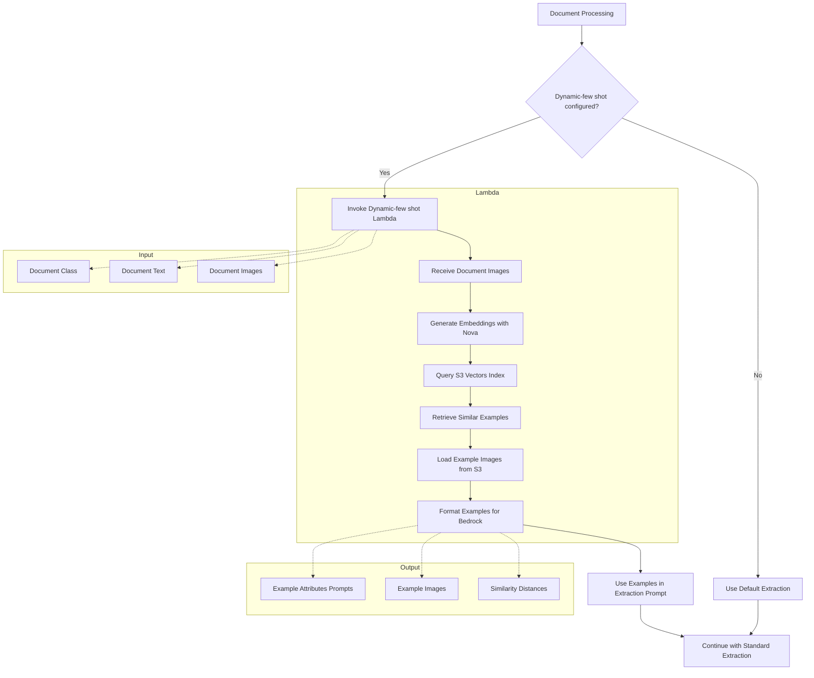

# Dynamic-Few Shot Prompting - Complete Guide

This directory contains the **complete implementation and demonstration** of the dynamic-few shot prompting feature for GenAI IDP Accelerator. This feature enables users to dynamically retrieve few-shot examples using S3 Vectors similarity search to improve extraction accuracy for Pattern 2.

## 🎯 Overview

The dynamic-few shot prompting feature allows you to:

- **Dynamically retrieve similar examples** based on document content using vector similarity search
- **Provide few-shot examples** to improve extraction accuracy through example-based prompting
- **Leverage S3 Vectors** for efficient similarity search across large example datasets
- **Integrate multimodal embeddings** using Amazon Nova models for image-based similarity
- **Customize example selection** based on document characteristics and business rules

## 📁 Files in This Directory

- **`GENAIIDP-dynamic-few-shot.py`** - Dynamic few-shot Lambda function with S3 Vectors lookup
- **`template.yml`** - CloudFormation SAM template to deploy the complete stack
- **`requirements.txt`** - Python dependencies for the Lambda function
- **`README.md`** - This comprehensive documentation and guide

## 🏗️ Architecture



## Quick Start

### Step 1: Deploy the Dynamic-few shot Stack

```bash
# Navigate to the dynamic-few-shot-lambda directory
cd plugins/dynamic-few-shot-lambda

# Deploy using AWS SAM
sam deploy --guided
```

### Step 2: Get the Lambda ARN

After deployment, get the ARN from CloudFormation outputs:

```bash
aws cloudformation describe-stacks \
    --stack-name GENAIIDP-dynamic-few-shot-stack \
    --query 'Stacks[0].Outputs[?OutputKey==`DynamicFewShotFunctionArn`].OutputValue' \
    --output text
```

### Step 3: Populate the Examples Dataset

Use the [fewshot_dataset_import.ipynb](notebooks/fewshot_dataset_import.ipynb) notebook to import a dataset into S3 Vectors, or manually upload your example documents and metadata to the S3 bucket and vector index created by the stack.

### Step 4: Configure IDP to Use Dynamic-few shot

Add the Lambda ARN to your IDP extraction configuration:

```yaml
extraction:
  custom_prompt_lambda_arn: "arn:aws:lambda:region:account:function:GENAIIDP-dynamic-few-shot"
```

## Lambda Interface

### Input Payload Structure
```json
{
  "class_label": "invoice",
  "document_text": "Text or markdown from section 1 (pages 1-3)...",
  "image_content": [
    "base64_encoded_image_1",
    "base64_encoded_image_2"
  ]
}
```

### Output Payload Structure
```json
[
  {
    "attributes_prompt": "Expected attributes are: invoice_number [Unique identifier], invoice_date [Invoice date], total_amount [Total amount]...",
    "class_prompt": "This is an example of the class 'invoice'",
    "distance": 0.122344521145, # lower is more similar
    "image_content": ["<base64_image_content_1>", "<base64_image_content_2>", ...]
  }
]
```

## Core Functionality

### 1. Vector Similarity Search

The Lambda uses Amazon Nova multimodal embeddings to find similar examples:

```python
# Generate embedding from document image
embedding = bedrock.generate_embedding(
    image_source=image_data,
    model_id=MODEL_ID,
    dimensions=S3VECTOR_DIMENSIONS,
)

# Query S3 Vectors for similar examples
response = s3vectors.query_vectors(
    vectorBucketName=S3VECTOR_BUCKET,
    indexName=S3VECTOR_INDEX,
    queryVector={"float32": embedding},
    topK=TOP_K,
    returnDistance=True,
    returnMetadata=True
)
```

### 2. Example Merging and Deduplication

Multiple document images are processed and results are merged to avoid duplicates:

```python
def merge_examples(combined_examples, new_examples):
    """Merge examples, keeping the best similarity score for duplicates"""
    for new_example in new_examples:
        key = new_example["key"]
        if combined_examples.get(key):
            # Keep the better (lower) distance score
            combined_examples[key]["distance"] = min(
                new_example.get("distance"),
                combined_examples[key]["distance"]
            )
```

### 3. Example Image Loading

The Lambda loads example images from S3 paths stored in vector metadata:

```python
def get_image_files_from_s3_path(image_path: str) -> List[str]:
    """Get list of image files from S3 path or prefix"""
    if image_path.endswith((".jpg", ".jpeg", ".png", ".gif", ".bmp", ".tiff", ".tif", ".webp")):
        return [image_path]  # Direct file
    else:
        return s3.list_images_from_path(image_path)  # Directory/prefix
```

## Configuration

### Environment Variables

The Lambda function uses these environment variables (set by the CloudFormation template):

- `S3VECTOR_BUCKET` - Name of the S3 Vectors bucket
- `S3VECTOR_INDEX` - Name of the S3 Vectors index
- `S3VECTOR_DIMENSIONS` - Embedding dimensions (e.g. `3072` for Nova Multimodal Embedding model)
- `MODEL_ID` - Bedrock model ID for embeddings (e.g. `amazon.nova-2-multimodal-embeddings-v1:0`)
- `TOP_K` - Number of similar examples to retrieve

### S3 Vectors Configuration

The stack creates:
- **Vector Bucket**: Encrypted S3 bucket for vector storage
- **Vector Index**: Cosine similarity index with 3072 dimensions
- **Metadata Configuration**: Stores `classPrompt`, `attributesPrompt`, and `imagePath` as non-filterable metadata keys

## Monitoring and Troubleshooting

### CloudWatch Logs

Monitor the Lambda function logs:
- `/aws/lambda/GENAIIDP-dynamic-few-shot` - Dynamic few-shot Lambda logs

### Key Log Messages

**Successful Operation:**
```
Processing document ID: document-123
Document class: invoice
Response contains 2 elements
```

**Error Conditions:**
```
No class_label found in event
No document_texts found in event or not in list format
Failed to load example images from s3://bucket/path: error
```

### Performance Monitoring

Key metrics to monitor:
- **Lambda Duration**: Time to retrieve and process examples
- **S3 Vectors Query Time**: Vector similarity search performance
- **Example Count**: Number of examples returned per request
- **Error Rate**: Failed example retrievals

## Example Dataset Structure

### Vector Metadata Format

Each vector in the S3 Vectors index should have metadata:

```json
{
  "classLabel": "invoice",
  "classPrompt": "This is an example of the class 'invoice'",
  "attributesPrompt": "Expected attributes are: invoice_number [Unique identifier], invoice_date [Invoice date], total_amount [Total amount]...",
  "imagePath": "s3://examples-bucket/invoices/example-001/"
}
```

### Image Storage Structure

Example images should be stored in S3 with paths referenced in metadata:

```
s3://examples-bucket/
├── invoices/
│   ├── example-001/
│   │   ├── page-1.jpg
│   │   └── page-2.jpg
│   └── example-002/
│       └── invoice.png
└── receipts/
    ├── example-003/
    │   └── receipt.jpg
    └── example-004/
        └── receipt.png
```

## Production Considerations

### 1. Example Dataset Management

- **Quality Control**: Ensure high-quality, representative examples
- **Regular Updates**: Keep examples current with document variations
- **Metadata Consistency**: Maintain consistent attribute descriptions
- **Image Optimization**: Use appropriate image formats and sizes

### 2. Performance Optimization

```python
# Cache frequently accessed examples
# Optimize vector dimensions for your use case
# Use appropriate TOP_K values (typically 2-5)
# Consider batch processing for multiple documents
```

### 3. Security Considerations

- **Access Control**: Restrict access to example datasets
- **Data Privacy**: Ensure examples don't contain sensitive information
- **Encryption**: Use appropriate encryption for stored examples
- **Audit Logging**: Log example usage for compliance

### 4. Cost Optimization

- **Vector Index Size**: Monitor storage costs for large example sets
- **Embedding Generation**: Optimize frequency of embedding updates
- **Lambda Memory**: Right-size memory allocation based on usage
- **S3 Storage Classes**: Use appropriate storage classes for examples

## Deployment Options

### Option 1: AWS SAM (Recommended)
```bash
sam build
sam deploy --guided
```

### Option 2: AWS CLI
```bash
# Package and deploy
aws cloudformation package \
    --template-file template.yml \
    --s3-bucket your-deployment-bucket \
    --output-template-file packaged-template.yml

aws cloudformation deploy \
    --template-file packaged-template.yml \
    --stack-name GENAIIDP-dynamic-few-shot-stack \
    --capabilities CAPABILITY_IAM
```

## Cleanup

To remove the dynamic-few shot resources:

```bash
# Delete the CloudFormation stack
aws cloudformation delete-stack --stack-name GENAIIDP-dynamic-few-shot-stack

# Note: S3 buckets with retention policy will be retained
```

## Integration with IDP

### Configuration in IDP Stack

Add the dynamic-few shot Lambda ARN to your IDP configuration:

```yaml
# In your IDP stack parameters or configuration
extraction:
  dynamic_few_shot_lambda_arn: "arn:aws:lambda:region:account:function:GENAIIDP-dynamic-few-shot"
```

### Expected Behavior

When configured:
1. IDP processes document and extracts images/text
2. Dynamic few-shot Lambda is invoked with document data
3. Lambda returns similar examples with prompts and images
4. IDP includes examples in extraction prompt to Bedrock
5. Bedrock uses examples to improve extraction accuracy

## Next Steps

After deploying the dynamic-few shot:

1. **Populate example dataset** with representative documents
2. **Test similarity search** with sample documents
3. **Monitor performance** and adjust TOP_K as needed
4. **Integrate with IDP** using the Lambda ARN
5. **Evaluate accuracy improvements** with few-shot examples

The dynamic-few shot enables powerful few-shot learning capabilities while leveraging efficient vector similarity search for dynamic example selection.