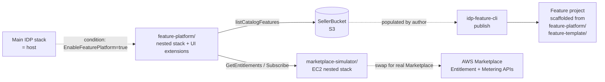

# subscription-features/

Source code for the IDP Accelerator's **subscription features** capability —
turning the main stack into a **host** for *installable subscription features*
delivered through AWS Marketplace (or a bundled local Marketplace simulator).

The capability is **opt-in** and **off by default** (`EnableFeaturePlatform=false`).
Existing deployments stay byte-for-byte compatible until an operator chooses to
enable it.

For the user-facing architecture, deployment instructions, GraphQL surface, and
8-step UX flow, see [`docs/feature-platform.md`](../docs/feature-platform.md).

## Layout

| Path | What it is |
|---|---|
| [`feature-platform/`](feature-platform/) | The **host platform**: nested CFN stack, AppSync resolvers, `InstalledFeatures` DDB table, host UI extensions (FeaturePage, nav), feature-author template + sample feature, e2e test harness. |
| [`marketplace-simulator/`](marketplace-simulator/) | Standalone AWS Marketplace stand-in (boto3-compatible). Auto-deployed as a t3.small EC2 nested stack when `EnableFeaturePlatform=true` and no user-supplied Marketplace endpoint. Also runnable locally for dev/CI. |
| [`marketplace-harness/`](marketplace-harness/) | Seller- + buyer-side SAM template (registration Lambda, lifecycle SQS, `/validate` + `/meter` API, `BatchMeterUsage` roll-up) that talks to the simulator during dev or to real AWS Marketplace in prod. Migration is two env vars (`AWS_ENDPOINT_URL_MARKETPLACE_*`). |

## Roles

- The **host** ([`feature-platform/main-stack-extensions/`](feature-platform/main-stack-extensions/)) deploys 7 Lambdas behind the AppSync API and an `InstalledFeatures` DDB table. The host UI ([`feature-platform/ui-extensions/`](feature-platform/ui-extensions/), already mirrored into [`src/ui/src/`](../src/ui/src/)) discovers features at runtime via `listCatalogFeatures` and dynamically loads each feature's UMD bundle from `WebUIBucket`.
- The **simulator** is what makes the whole thing run on a single AWS account during development — without it you'd need a live Marketplace listing and a paying buyer to exercise the entitlement path.
- The **harness** is the seller/buyer scaffolding around real AWS Marketplace. It's only relevant once you're publishing to the real Marketplace.

## Adding a new feature

You don't need to change anything in this directory. Feature authors:
1. `pip install -e lib/idp_feature_sdk`
2. `idp-feature-cli init ./my-feature --feature-id my-feature --display-name "My Feature"`
3. Implement the three parts (UMD bundle, optional Lambda, SAM `template.yaml`).
4. `idp-feature-cli build && idp-feature-cli publish` to push artifacts to a seller bucket.

Full step-by-step walkthrough:
[`feature-platform/docs/CREATING-A-FEATURE.md`](feature-platform/docs/CREATING-A-FEATURE.md).

## Status

| Phase | Directory | Status |
|---|---|---|
| A — Host backend | [`feature-platform/main-stack-extensions/`](feature-platform/main-stack-extensions/) | ✅ Implemented (58 pytest cases) |
| B — Host UI | [`feature-platform/ui-extensions/`](feature-platform/ui-extensions/) (mirrored to `src/ui/src/`) | ✅ Implemented (80 vitest cases) |
| C — Author SDK | [`feature-platform/feature-template/`](feature-platform/feature-template/) + [`lib/idp_feature_sdk/`](../lib/idp_feature_sdk/) | ✅ Implemented (`idp-feature-cli init/build/publish`, 21 pytest cases) |
| D — Sample feature | [`feature-platform/sample-feature/`](feature-platform/sample-feature/) (`docs-by-status`) | ✅ Implemented and auto-published at deploy time |
| E — Test harness | [`feature-platform/test-harness/`](feature-platform/test-harness/) | ✅ Implemented (13 e2e pytest cases covering the 7-state lifecycle) |
| F — Simulator | [`marketplace-simulator/`](marketplace-simulator/) | ✅ Implemented and auto-deployed when no user endpoint is supplied |

## Each subdirectory has its own README

- [`feature-platform/README.md`](feature-platform/README.md) — implementation
  layout, build phases, integration points
- [`marketplace-simulator/README.md`](marketplace-simulator/README.md) —
  endpoints, admin/data-plane API, Caddy + nip.io setup
- [`marketplace-harness/README.md`](marketplace-harness/README.md) —
  seller/buyer flows, Marketplace migration recipe
