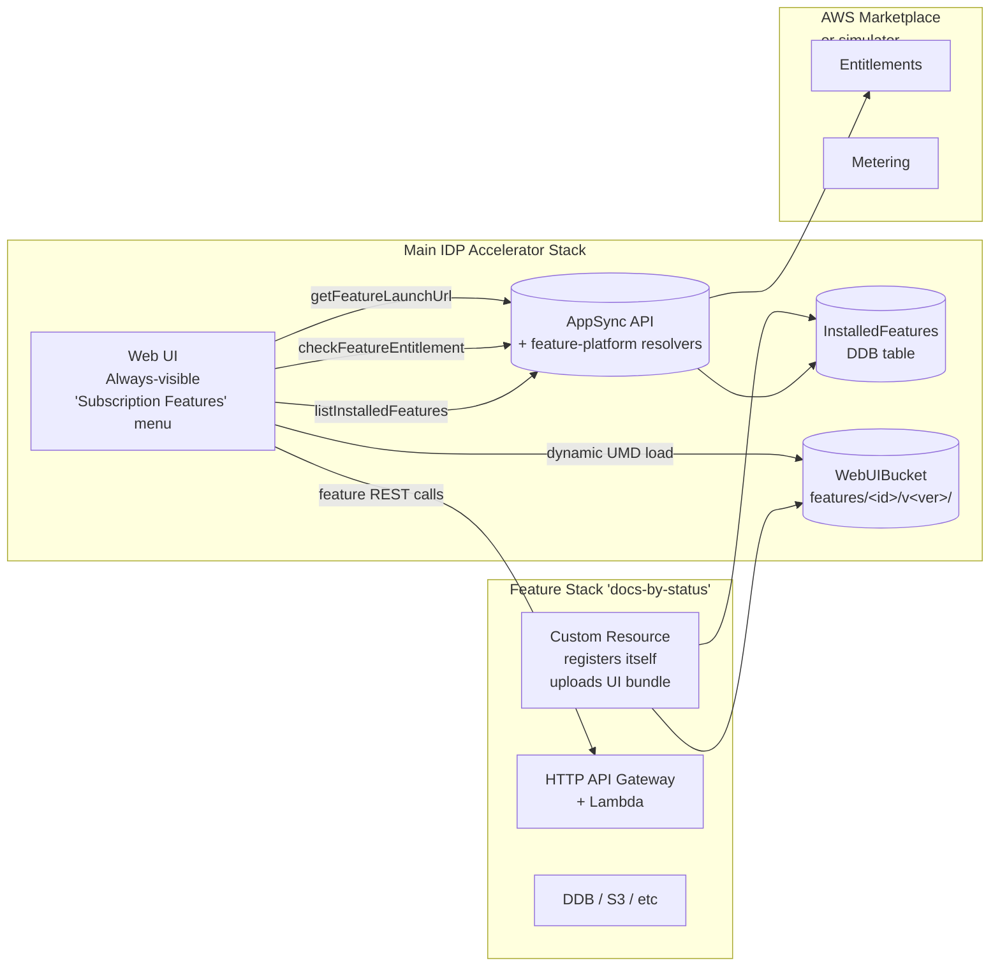

# Feature Platform (prototype)

Turns the IDP Accelerator main stack into a **host** for *installable subscription features* delivered through AWS Marketplace (or the local [marketplace-simulator](../marketplace-simulator/)).

A "feature" is an independent CloudFormation stack that a subscribed admin launches into the same AWS account as the main IDP stack. Once launched, its UI bundle is copied into the main stack's `WebUIBucket` and it appears as a nav item inside the existing IDP web UI.



## Directory layout

```
subscription-features/feature-platform/
├── main-stack-extensions/      Phase A: additive pieces for the main stack
│   ├── cfn/                    Nested stack template
│   ├── appsync/                GraphQL schema fragment
│   ├── lambdas/                4 Lambda handlers
│   ├── tests/                  pytest unit tests
│   ├── apply-to-main-stack.md  Integration instructions
│   └── README.md
├── feature-template/           Phase C: "copy this" scaffold for feature authors
├── sample-feature/             Phase D: working 'docs-by-status' example
├── test-harness/               Phase E: mini-main-stack + e2e tests
└── docs/                       architecture, CREATING, PUBLISHING, security, testing
```

## Build order

| Phase | Directory                       | Status |
|-------|---------------------------------|--------|
| A     | `main-stack-extensions/`        | ✅ complete — nested stack, 7 Lambdas, schema, 58 pytest cases |
| B     | Changes under `src/ui/src/`     | ✅ complete — FeaturePage, catalog+installed nav, 80 vitest cases |
| C     | `feature-template/` + `lib/idp_feature_sdk/` | ✅ complete — `idp-feature-cli build/publish`, 21 pytest cases |
| D     | `sample-feature/`               | ✅ complete — `docs-by-status`, auto-published at deploy time |
| E     | `test-harness/`                 | ✅ complete — 13 e2e pytest cases covering the 7-state machine |
| F     | simulator integration           | ✅ complete — auto-deployed nested stack, admin grant/expire APIs |

See [`../../docs/feature-platform.md`](../../docs/feature-platform.md) for the
user-facing architecture, deployment, and 8-step UX flow.

Enable end-to-end with:

```bash
idp-cli deploy --params EnableFeaturePlatform=true
```

See [`CONTINUATION_PLAN.md`](./CONTINUATION_PLAN.md) for the detailed
implementation history across tasks 1-7.
