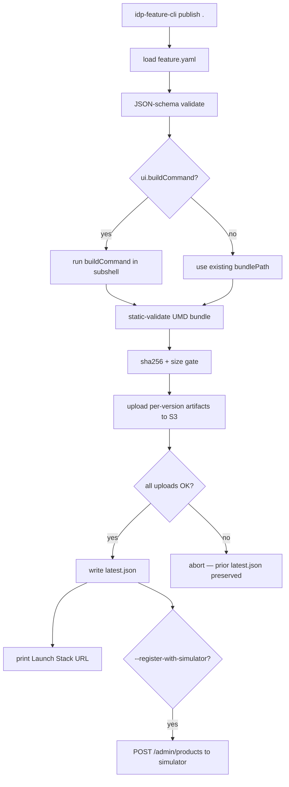

# Publishing an IDP Accelerator Feature

This document covers the publishing workflow — what `idp-feature-cli publish`
does, the S3 layout it produces, and how to wire it up to AWS Marketplace (or
the local simulator).

See [CREATING-A-FEATURE.md](CREATING-A-FEATURE.md) for the companion "how to
write a feature" guide.

## Publisher lifecycle



## S3 layout

Every published version lands in the same shape (driven by `s3_prefix` which
defaults to `features`):

```
s3://<seller-bucket>/features/<featureId>/latest.json       # {"featureId","version","bundleSha256","publishedAt"}
s3://<seller-bucket>/features/<featureId>/v<version>/
    ├── template.yaml          # CloudFormation stack
    ├── ui-bundle.js           # UMD React bundle
    ├── manifest.json          # Public form of feature.yaml
    └── sha256.txt             # One line per artifact: `<sha256>  <filename>`
```

The main stack's Phase A Lambdas read this exact layout:
- `list_installed_features` fetches `latest.json` to populate `latestVersion` /
  `updateAvailable` on each installed feature.
- `get_feature_launch_url` fetches the per-version `manifest.json` to read
  `defaultParameters` (which populate CFN console parameter pre-fills).

## latest.json as an atomic switch

`latest.json` is written **only after** every per-version object uploads
successfully. This means:

- A failed publish (network error, S3 throttle, bad credentials) leaves the
  prior `latest.json` untouched — your customers don't see a half-broken
  version.
- To roll back to an older version, simply overwrite `latest.json` with the
  older SemVer — no bundle re-upload needed.

## Uploading with public or private read?

`idp-feature-cli publish` defaults to **private** S3 ACLs — your main-stack's
`get_feature_launch_url` Lambda reads objects via the IAM role that's granted
`s3:GetObject` on the seller bucket. But the **CloudFormation Console
quick-create URL** requires `templateURL` to be HTTPS-readable by the browser
performing the click. Two options:

### Option A — `--make-public`
```bash
idp-feature-cli publish . --seller-bucket idp-mp-prod --make-public
```
Uploads objects with `ACL=public-read`. Simplest. Requires your bucket's
**Block Public Access** settings permit ACL-based public grants.

### Option B — bucket policy
Leave objects private; add a bucket policy that allows anonymous
`s3:GetObject` on `features/*`. Example:
```json
{
  "Effect": "Allow",
  "Principal": "*",
  "Action": "s3:GetObject",
  "Resource": "arn:aws:s3:::<bucket>/features/*"
}
```

Either way, the main-stack Lambda reads objects with its IAM role, not
anonymously — the public grant exists only to satisfy the browser's request
for `templateURL`.

## Simulator integration

```bash
idp-feature-cli publish . \
    --seller-bucket idp-mp-dev \
    --register-with-simulator http://127.0.0.1:8080 \
    --simulator-product-code prod-my-feature
```

On successful publish, the publisher POSTs to `<simulator>/admin/products`
to create (or idempotently update) a product in the simulator. Subscribers
can then exercise the `GetEntitlements` path without a real Marketplace
listing.

See `subscription-features/marketplace-simulator/` for the simulator server.

## CI integration

A minimal GitLab / GitHub pipeline:

```yaml
publish:
  image: python:3.12
  before_script:
    - pip install -e ./lib/idp_feature_sdk
  script:
    - idp-feature-cli validate ./my-feature
    - idp-feature-cli publish ./my-feature
        --seller-bucket $SELLER_BUCKET
        --region $AWS_REGION
```

Store `SELLER_BUCKET` and OIDC-assumed AWS credentials as pipeline variables.

## Running from CI: minimal permissions

The IAM role assumed by CI needs, on the seller bucket:
- `s3:PutObject`, `s3:PutObjectAcl` (if `--make-public`), `s3:DeleteObject`
- `s3:ListBucket`

No access to any main-stack resources is needed — publishing is entirely
isolated to the seller bucket.

## AWS Marketplace listing

When you're ready to list the feature on the real Marketplace:

1. Create a product (SaaS Subscription or SaaS Contract) in the Marketplace
   Management Portal.
2. Paste your feature's public `template.yaml` URL into the **Quick Launch
   template URL** field. This is the URL the `publish` command printed.
3. Set up dimensions matching your `feature.yaml -> marketplace.productCode`
   and dimension keys.
4. Once the listing is live, add the product code to the main stack's
   `FeaturePlatformProductCodeMap` parameter:
   ```
   FeaturePlatformProductCodeMap={"my-feature":"<marketplace-product-code>"}
   ```

After that, subscribed customers see `state=ACTIVE` from `GetEntitlements`
and the UI flips from "Subscription required" to "Install".
