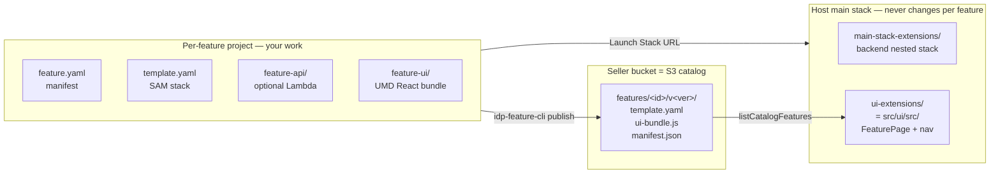

# Feature Platform Docs — Start Here

This folder is the **canonical entry point for feature authors** building
new subscription features for the IDP Accelerator. It complements
[`docs/feature-platform.md`](../../../docs/feature-platform.md) (operator-facing)
with implementation-level guidance.

## Read in this order

| # | Doc | Audience | Purpose |
|---|---|---|---|
| 1 | [`docs/feature-platform.md`](../../../docs/feature-platform.md) | All | High-level architecture, GraphQL surface, UX flow, deployment params, cost. Read first to understand what the platform *is*. |
| 2 | [`../README.md`](../README.md) | Implementers | Platform's own directory layout, build phases (A–F), status of each piece. |
| 3 | [`CREATING-A-FEATURE.md`](CREATING-A-FEATURE.md) | **Feature authors** | Step-by-step: scaffold → build → publish → install. |
| 4 | [`HOST-CONTRACT.md`](HOST-CONTRACT.md) | **Feature authors** | The runtime contract: what `FeatureContext` provides, what externals are guaranteed, what `window.IdpFeatures.register` expects. |
| 5 | [`PUBLISHING-A-FEATURE.md`](PUBLISHING-A-FEATURE.md) | Feature authors | S3 layout, public-vs-private, simulator hookup, CI snippet, real Marketplace listing. |
| 6 | [`SAMPLE-FEATURE-WALKTHROUGH.md`](SAMPLE-FEATURE-WALKTHROUGH.md) | Feature authors | File-by-file annotated tour of the bundled `docs-by-status` sample. |
| 7 | [`../../marketplace-simulator/README.md`](../../marketplace-simulator/README.md) | Local-dev | Simulator endpoints (admin grant/expire, entitlements, metering), Caddy + nip.io setup. |

## TL;DR for "I want to add a new feature"

```bash
pip install -e lib/idp_feature_sdk

idp-feature-cli init ./my-feature \
    --feature-id my-feature \
    --display-name "My Feature" \
    --version 0.1.0

cd my-feature
# Implement: feature-ui/, feature-api/, template.yaml, feature.yaml
idp-feature-cli build .
idp-feature-cli publish . --seller-bucket idp-mp-dev --region us-east-1
```

The full step-by-step is in [`CREATING-A-FEATURE.md`](CREATING-A-FEATURE.md).
The `feature-template/` you're scaffolding from is a complete, lint-clean,
buildable project — copy + substitute is all `init` does.

## Mental model



The host (Phases A+B) is generic; **adding a new feature never requires
changing the main stack or `src/ui`** — the UI discovers features at
runtime via `listCatalogFeatures` and loads their UMD bundle from
`WebUIBucket`.

## Frequently asked

**Q: Do I need to modify `template.yaml` or `src/ui/` to add a feature?**
A: No. The host is feature-agnostic. Only your `template.yaml` (the
*feature's*, not the main stack's) and your `feature-ui/` change.

**Q: Where does my UI bundle get loaded from?**
A: `WebUIBucket/features/<featureId>/v<version>/ui-bundle.js`. The
`RegisterFeature` custom resource in your feature's `template.yaml`
(see `ui-deployer/handler.py`) copies it from the seller bucket on
install and registers the feature in the `InstalledFeatures` DDB table.

**Q: How does my feature reach the user's auth token?**
A: Through the `FeatureContext` prop (`getAuthToken()`). See
[`HOST-CONTRACT.md`](HOST-CONTRACT.md) for the full contract.

**Q: What if I don't need a Lambda backend?**
A: Delete `feature-api/` from your scaffold and remove the
`FeatureApi` / `FeatureApiFunction` resources from `template.yaml`.
The `featureApiEndpoint` in `FeatureContext` will be `null`; your UI
should handle that gracefully (see how `sample-feature/feature-ui/src/App.tsx`
uses `if (!featureApiEndpoint) { ... }`).

**Q: Can I bundle React / Cloudscape with my feature?**
A: No — the `idp-feature-cli build` validator rejects bundles that include
React, ReactDOM, Cloudscape, or aws-amplify. The host provides them as
externals via `feature-host-globals.ts` so all features share a single
React instance (avoids the "two copies of React" hooks error).

**Q: How do I test locally without paying for a real Marketplace listing?**
A: Use the bundled `marketplace-simulator/` (auto-deployed as a
nested stack when `EnableFeaturePlatform=true` and
`FeaturePlatformSimulatorEndpoint` is blank). See [`CREATING-A-FEATURE.md`
§4](CREATING-A-FEATURE.md#4-test-locally-with-the-simulator).

## When you're stuck

1. Look at the troubleshooting table at the bottom of
   [`CREATING-A-FEATURE.md`](CREATING-A-FEATURE.md#6-troubleshooting).
2. Compare your feature project against the bundled
   [`sample-feature/`](../sample-feature/) — it's the canonical reference.
3. Check the 7-state lifecycle test as an executable spec:
   [`../test-harness/test_seven_state_machine.py`](../test-harness/test_seven_state_machine.py).
4. Inspect the host's FeaturePage state machine:
   [`../ui-extensions/components/feature-page/FeaturePage.tsx`](../ui-extensions/components/feature-page/FeaturePage.tsx).
