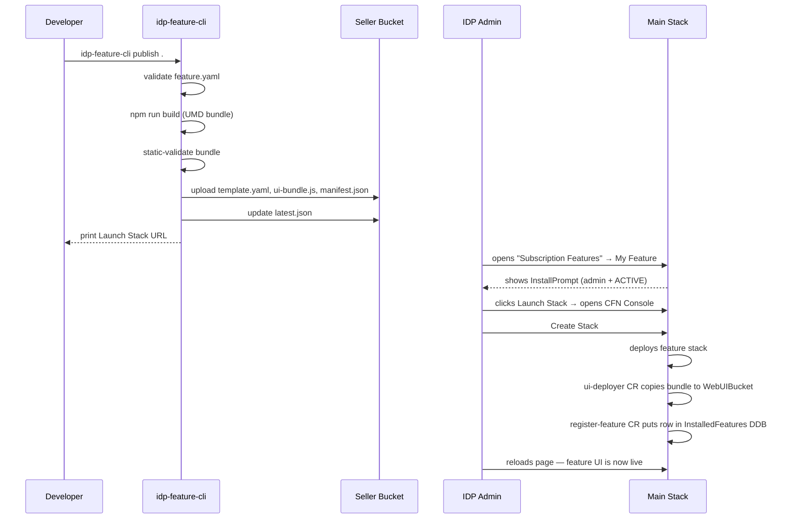

# Feature Template — copy this to start a new feature

This is a scaffold for building an installable IDP Accelerator subscription
feature. The recommended way to use it is via the SDK CLI:

```bash
pip install -e lib/idp_feature_sdk
idp-feature-cli init ./my-feature \
    --feature-id my-feature \
    --display-name "My Feature"
```

That copies this directory and substitutes the placeholder `featureId` /
`displayName` / `version` literals throughout. You can also `cp -r` the
whole directory and find-replace `my-feature` / `My Feature` / `0.1.0`
manually if you prefer.

## Structure

```
feature-template/
├── feature.yaml              # Manifest — edit featureId, displayName, etc.
├── template.yaml             # CloudFormation stack for the feature
├── feature-api/              # Optional backend Lambda(s) + HTTP API Gateway
│   ├── handler.py
│   └── tests/
│       └── test_handler.py   # Pytest stub — `cd feature-api && pytest`
├── feature-ui/               # React UMD bundle — rendered inside the host UI
│   ├── package.json
│   ├── vite.config.ts
│   ├── tsconfig.json
│   ├── src/
│   │   ├── entry.tsx         # Calls window.IdpFeatures.register(...)
│   │   └── App.tsx           # Your feature's root React component
│   └── index.html            # Needed by Vite dev server; not published
├── ui-deployer/              # Custom-resource Lambda that copies the UMD
│                             # bundle from the seller bucket into the main
│                             # stack's WebUIBucket. Registers the feature
│                             # via the main stack's AppSync API on stack
│                             # Create/Delete.
│   └── handler.py
└── publish.py                # Thin wrapper that calls idp-feature-cli publish
```

## Workflow



## Implementing the host contract

### UI bundle
Your `feature-ui/src/entry.tsx` **must** call:

```ts
window.IdpFeatures.register('my-feature', {
  Component: App,              // receives FeatureContext as props
  version: '0.1.0',            // must match feature.yaml -> version
  displayName: 'My Feature',
});
```

And your `feature-ui/vite.config.ts` **must** externalise React/ReactDOM/
Cloudscape/aws-amplify (see the provided example).

### Backend API (optional)
If your feature needs a backend, `template.yaml` should create an HTTP API
Gateway + Lambda(s) and output the endpoint. The ui-deployer CR reads that
output and writes it to `InstalledFeatures.featureApiEndpoint` so the
host passes it to your UI via `FeatureContext.featureApiEndpoint`.

Cognito JWT auth: the UI calls `context.getAuthToken()` to get a fresh
Bearer token — configure your API Gateway to verify against the main stack's
User Pool (import `<MainStackName>-UserPoolId`).

### Main-stack registration
Your `template.yaml` must include a `RegisterFeature` custom resource
(see `ui-deployer/handler.py`) that calls the main stack's AppSync
`registerFeature` mutation on Create/Update and `unregisterFeature` on
Delete. Without this, your feature never shows up in the UI's nav.

## Local testing (no real AWS Marketplace)

1. Start the local simulator:
   ```
   cd subscription-features/marketplace-simulator
   python -m mp_simulator.server
   ```
2. Publish with simulator registration:
   ```
   idp-feature-cli publish . \
       --seller-bucket idp-marketplace-dev \
       --region us-east-1 \
       --register-with-simulator http://127.0.0.1:8080
   ```
3. Deploy the main IDP stack with `EnableFeaturePlatform=true`,
   `FeaturePlatformSellerBucket=idp-marketplace-dev`, and
   `FeaturePlatformSimulatorEndpoint=http://127.0.0.1:8080`.
4. Open the IDP Web UI — "My Feature" appears under Subscription Features.

See [CREATING-A-FEATURE.md](../docs/CREATING-A-FEATURE.md) for the full walkthrough.
