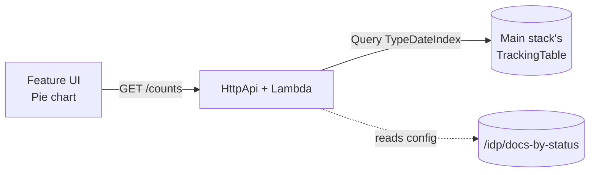

# sample-feature: `docs-by-status`

A working reference implementation of an IDP Accelerator installable feature.
Built from `feature-template/`, with the feature-specific pieces filled in.

## What it does

Adds a **Docs By Status** page to the IDP UI that shows a pie chart of how
many documents are in each status (NEW, QUEUED, RUNNING, COMPLETED, FAILED,
…). The counts are fetched from a feature-specific HTTP API that queries the
main stack's `TrackingTable` (via a cross-stack read role), filtering to
`ItemType='document'` via the `TypeDateIndex` GSI.



## How this differs from `feature-template/`

The template is a scaffold; this is a concrete, runnable feature:

| Template               | Sample                                          |
|------------------------|-------------------------------------------------|
| `feature.yaml` — `my-feature` | `feature.yaml` — `docs-by-status`          |
| `App.tsx` — hello-world stub | `App.tsx` — Cloudscape PieChart + KeyValuePairs |
| `handler.py` — echoes username | `handler.py` — queries TrackingTable, returns counts |
| `template.yaml` — no host-data permissions | adds read permission on `<MainStackName>-TrackingTableName` |

## Publishing

```bash
cd subscription-features/feature-platform/sample-feature
idp-feature-cli publish . \
    --seller-bucket idp-marketplace-dev \
    --region us-east-1 \
    --register-with-simulator http://127.0.0.1:8080 \
    --simulator-product-code prod-docs-by-status
```

Then deploy the main IDP stack with:
```
EnableFeaturePlatform=true
FeaturePlatformSellerBucket=idp-marketplace-dev
FeaturePlatformSimulatorEndpoint=http://127.0.0.1:8080
FeaturePlatformProductCodeMap={"docs-by-status":"prod-docs-by-status"}
FeaturePlatformDefaultCustomerIdentifier=CUST-dev
```

Subscribe the dev customer in the simulator, reload the UI, install the
feature — the "Docs By Status" page appears under **Subscription Features**.
