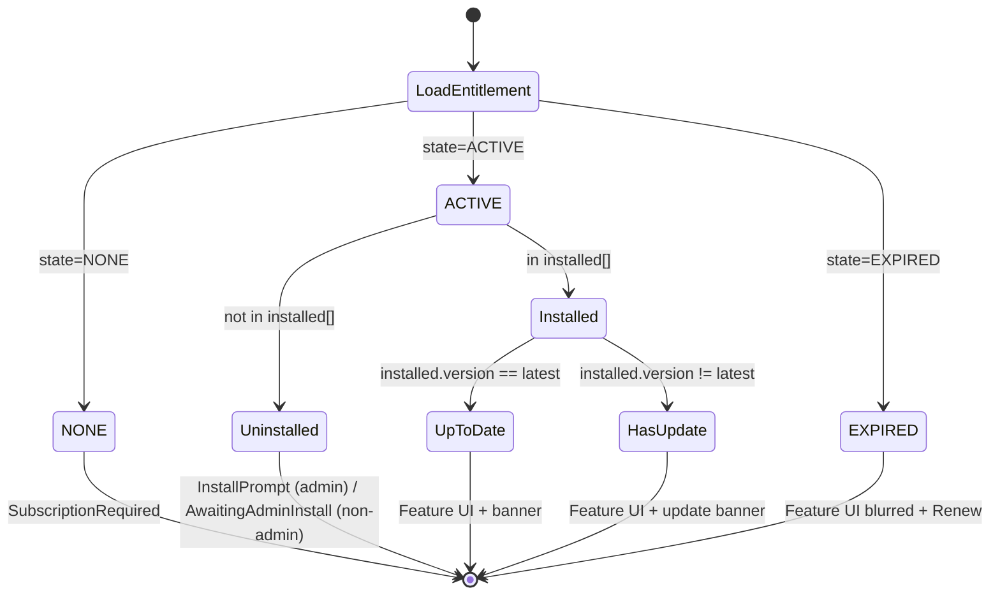

# Phase B — UI extensions

Additive React / TypeScript / Cloudscape pieces that teach the existing web UI
how to host installable subscription features. Nothing in `src/ui/` has been
modified yet — the files in this directory are drop-in copies to be placed at
the paths documented below.

## Files

```
ui-extensions/
├── components/
│   ├── feature-page/
│   │   ├── FeaturePage.tsx            # 7-state renderer
│   │   ├── FeatureLoader.tsx          # Dynamic UMD bundle loader
│   │   ├── FeatureStateMessages.tsx   # Alert/banner components per state
│   │   └── index.ts
│   └── feature-page.test.tsx          # Jest/Vitest tests for the renderer
├── hooks/
│   ├── use-installed-features.ts
│   ├── use-feature-entitlement.ts
│   ├── use-feature-launch-url.ts
│   └── index.ts
├── graphql/
│   └── feature-platform.ts            # GraphQL operation strings (mirrors Phase A schema)
├── types/
│   └── feature-platform.ts            # TypeScript types mirroring the GraphQL types
├── routes/
│   └── feature-platform-constants.ts  # New route constants
├── navigation/
│   └── feature-platform-nav-items.ts  # Nav-item snippets (always-visible)
└── apply-to-main-ui.md                # Step-by-step patch instructions
```

## Target layout (after apply)

```
src/ui/src/
├── components/
│   └── feature-page/                 # <- copied from here
├── hooks/
│   ├── use-installed-features.ts     # <- copied from here
│   ├── use-feature-entitlement.ts    # <- copied from here
│   └── use-feature-launch-url.ts     # <- copied from here
├── graphql/
│   └── feature-platform.ts           # <- copied from here (plus generated mirror)
├── types/
│   └── feature-platform.ts           # <- copied from here
└── routes/
    └── constants.ts                  # <- patched: add FEATURES_PATH_PREFIX, FEATURE_DETAIL_PATH
```

## 7-state UI state machine (as implemented in `FeaturePage.tsx`)

| Entitlement | Installed | Role    | UI                                             |
|-------------|-----------|---------|------------------------------------------------|
| NONE        | any       | any     | `SubscriptionRequired` (Alert + Marketplace link) |
| ACTIVE      | no        | admin   | `InstallPrompt` (Launch Stack button)          |
| ACTIVE      | no        | non-adm | `AwaitingAdminInstall` (ask your admin)        |
| ACTIVE      | yes, =v   | any     | Feature UI + "v1.2.3 — Up to date" banner       |
| ACTIVE      | yes, <v   | admin   | Feature UI + "Update to v1.2.4" banner + btn   |
| ACTIVE      | yes, <v   | non-adm | Feature UI + "Update available — ask admin"   |
| EXPIRED     | yes       | any     | Feature UI blurred + "Subscription expired" + Renew |



## UMD bundle contract (how features are loaded into the UI)

See [`components/feature-page/FeatureLoader.tsx`](components/feature-page/FeatureLoader.tsx)
and [`apply-to-main-ui.md`](apply-to-main-ui.md) for the full contract. Summary:

- Feature is shipped as a **single UMD script** at
  `/features/<featureId>/v<version>/ui-bundle.js` (relative to the CloudFront
  origin — same origin as the main UI, so no CORS).
- When loaded it calls `window.IdpFeatures.register(featureId, { Component, version, displayName })`.
- `React`, `ReactDOM`, `@cloudscape-design/components`, `@cloudscape-design/design-tokens`,
  and `aws-amplify` are **externals** — provided by the host so the bundle stays small
  and version-consistent with the host.
- The loader times out at 30s if the bundle fails to register.
