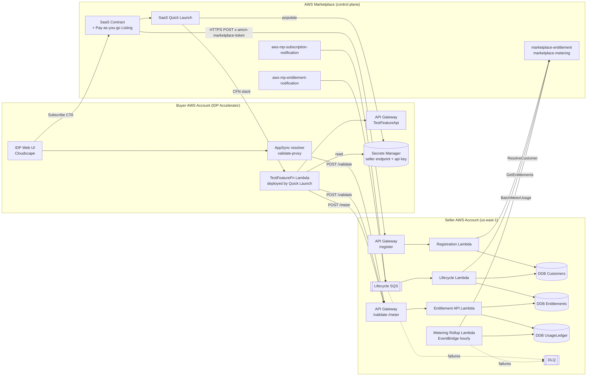

# Architecture — Marketplace Subscription Harness

## Context

The GenAI IDP Accelerator is an open-source product. We need to monetize a
premium feature (the real goal is **AutoTune**) via AWS Marketplace while:

1. Keeping the core product open-source.
2. Preventing tampering with entitlement checks (open-source code is readable).
3. Working inside AWS Marketplace's real constraints:
   - `GetEntitlements` / `BatchMeterUsage` **must be called from the seller
     account**, not the buyer account (ref: feasibility doc §"Subscription
     Validation and Entitlement Checking").
   - `GetEntitlements` is only in `us-east-1`.
   - Free trials **do not auto-convert** — UI must actively prompt.
   - Pricing model **cannot change after publication** — pick SaaS Contract +
     pay-as-you-go for maximum flexibility up front.
   - Starting **June 1 2026**, new SaaS products must use `CustomerAWSAccountId`
     and `LicenseArn` — we adopt this from day 1.

## Chosen architecture: Hybrid SaaS (Option A from feasibility doc)

Premium logic runs **server-side in the seller's AWS account**. The customer's
AWS account runs only a lightweight shim Lambda that calls our seller API to
validate + meter each use. This neutralizes the open-source bypass risk because
the valuable work never runs on the buyer's side.

License Manager integration (Option C) is **interface-stubbed** and deferred to
a follow-up phase.

## Component diagram

## Data model

### DDB `Customers`
| Attribute | Type | Notes |
|---|---|---|
| `customerIdentifier` (PK) | String | From `ResolveCustomer` response |
| `customerAWSAccountId` | String | Preferred key post-2026 |
| `productCode` / `licenseArn` | String | Both stored for migration |
| `status` | String | `trial`, `active`, `unsubscribe-pending`, `cancelled` |
| `trialEndsAt` | Number | Epoch seconds; null for paid |
| `contractEntitlement` | Number | e.g., 100 docs/month from contract dimension |
| `overageEnabled` | Bool | Pay-as-you-go or block-on-exceed |
| `createdAt`, `updatedAt` | Number | Epoch |

### DDB `Entitlements` (cache of `GetEntitlements` results)
| Attribute | Type | Notes |
|---|---|---|
| `customerIdentifier` (PK) | String | |
| `dimension` (SK) | String | e.g., `test_capacity_docs` |
| `value` | Mixed | Integer / boolean |
| `expirationDate` | Number | Epoch |
| `refreshedAt` | Number | Epoch — TTL 5 min |

### DDB `UsageLedger` (append-only)
| Attribute | Type | Notes |
|---|---|---|
| `customerIdentifier` (PK) | String | |
| `eventId` (SK) | String | `<hour_epoch>#<dimension>#<resourceId>` — idempotency key |
| `dimension` | String | `test_docs_processed` / `test_docs_overage` |
| `quantity` | Number | Usually 1 |
| `billingPeriod` | String | `YYYY-MM` — for period-reset |
| `meteredAt` | Number | Null until rolled up |
| `meteringStatus` | String | `pending`, `metered`, `failed` |

GSI: `billingPeriod-customerIdentifier` for fast period totals.

## Security model

- **No seller credentials in buyer account.** Buyer's `TestFeatureFn` calls the
  seller API with an API key stored in buyer's Secrets Manager (populated by
  Quick Launch). Seller-side IAM enforces per-customer rate limits.
- **Mutual TLS / SigV4 (future).** Upgrade path documented in `FINDINGS.md`.
- **Rate limiting** at API Gateway by API key + usage plan.
- **Audit.** Every call logged to CloudWatch + CloudTrail; `UsageLedger` is the
  source of truth.
- **License Manager (Phase 5+).** Adds cryptographic signing so even if the
  buyer tampers with `TestFeatureFn` locally, `CheckoutLicense` at cold start
  would reject. Not in this prototype.

## Failure modes

| Failure | Handling |
|---|---|
| `/validate` unreachable | Buyer-side cache (5 min) — fail open for duration, fail closed after |
| `/meter` unreachable | Buyer-side retry queue (SQS); 6h `BatchMeterUsage` window leaves us plenty |
| `BatchMeterUsage` throttles / errors | Exponential backoff up to 30 min; do **not** fail closed in < 2h per AWS guidance |
| `CustomerNotEntitledException` | Flag customer `cancelled` in DDB; stop metering |
| SNS lifecycle message loss | SQS with DLQ + CloudWatch alarm on DLQ depth |
| Clock skew | Timestamps rounded to hour boundary; idempotency key absorbs |

## 2026 API migration readiness

All code paths accept and persist **both**:

- legacy: `CustomerIdentifier`, `ProductCode`
- new (2026): `CustomerAWSAccountId`, `LicenseArn`

Internal handlers prefer the new fields when present. A feature flag
`USE_2026_API=true` switches the SDK call sites to the new shapes — default
`true` from the start.
